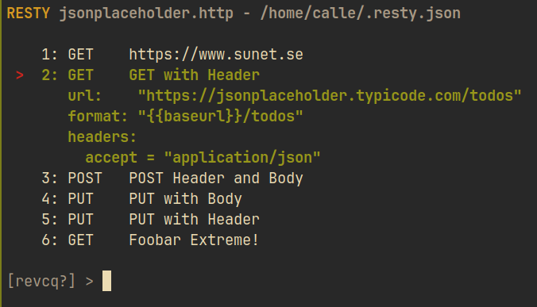

# RESTY

_A command line interface on Linux and Windows for running and managing requests in a
.http-file._



## How it works

Run `resty` with a .http-file as argument.

```
$ resty test_rest.http
```

Resty will display the endpoints and let the user navigate and run them
using the `curl` command. 

The .http-file can be edited by pressing `e` as long as you have the
`$EDITOR` environment variable set or set it in the config file.


## Help (`resty -h`)

```
RESTY
    SYNOPSIS
          resty [flags] <.http-file>

    DESCRIPTON
          Resty opens the <.http-file> and displays list of the requests.
          The list can be navigated using vim-like bindings or arrow keys.

          Requests can be run and the .http-file edited.

          For more info press '?' to show the available commands.

    OPTIONS
        -c   config file (default: "")
        -g   print default config file (default: "false")
        -v   version information (default: "false")
```


## CLI Commands (`?`)
```
Navigation

  Arrow keys or Vim (jk) for navigating endpoint list.

  g - Jump to first request
  G - Jump to last request

Commands

  r - Run currently selected request, <enter>
  v - View variables set for current request
  e - Edit the input file using Editor config setting or $EDITOR environment variable
  c - Show config settings

  ? - Show this help
  q - Quit Resty
```


## Configuration

Default configuration can be printed by running `resty -g`. Like
```
$ resty -g > ~/.resty.json
```

Example config file:
```
{
  "CurlCommand": "notcurl",
  "Editor": "edlin.exe",
  "ColorMode": true,
  "InsecureSSL": true
}
```
Default values if settings are empty or not present:
- CurlCommand = curl
- Editor = `$EDITOR` (or `%EDITOR%`)
- ColorMode = false
- InsecureSSL = false (if true, the -k flag will be sent to curl)


## Future

Some ideas about possible improvements.

- Add response formatters per header accept values.
    - i.e if header has `accept: application/json` then use formatter
      defined in config (like jq) to format the response.
- Maybe replace curl command execution with home made implementation.

/Calle

